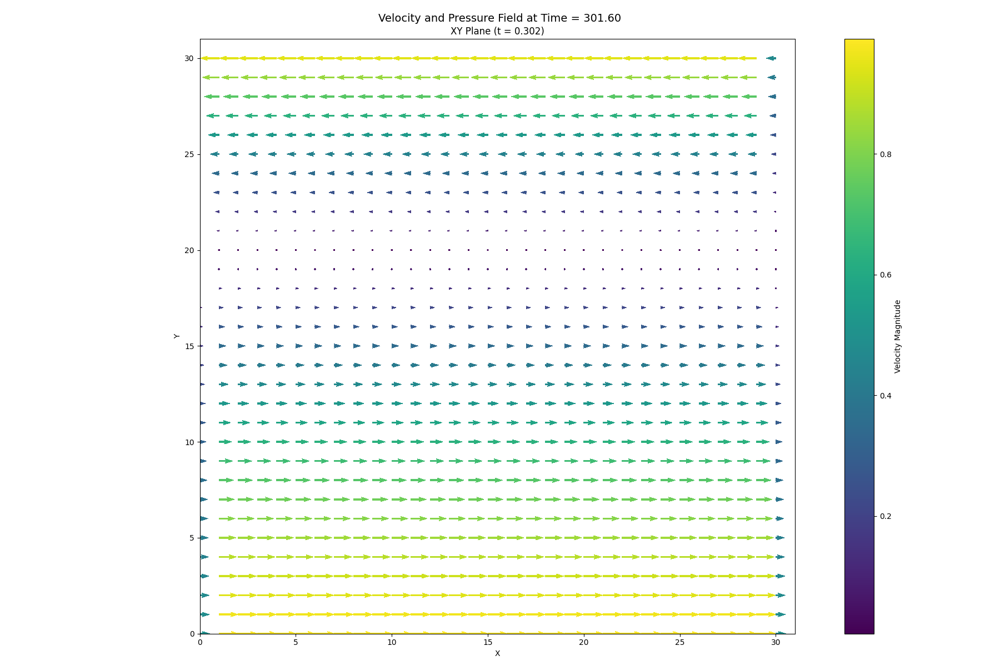

# Experimental Report
### Case: Poiseuille Flow with Moving Walls
Description of Flow:

This case represents pressure-driven channel flow in which the two horizontal walls move at a prescribed speed while the fluid is forced along the streamwise direction by a constant body force. The boundary motion adds wall shear to the conventional Poiseuille profile, producing a skewed velocity distribution that is still dominated by viscous diffusion and the imposed forcing. The target is to recover the governing streamwise momentum equation from the saved velocity and pressure fields.

> Numerical identification of the streamwise momentum equation from saved velocity and pressure fields.

## 1. Governing Equation Verification

### Reference equation

`u_t =8.80434783e-05*u_yy + 9.81000000e+00*one`

### Learned equation

`u_t =- 2.08702206e-10*u*u_y + 2.68851484e-07*u + 1.56320160e-08*u_y + 8.84726794e-05*u_yy + 9.85782285e+00*one`

| Term | Reference coefficient | Learned coefficient | Absolute error |
|---|---:|---:|---:|
| `u*u_y` | `+0.00000000e+00` | `-2.08702206e-10` | `2.08702206e-10` |
| `u*u_yy` | `+0.00000000e+00` | `+4.66507141e-12` | `4.66507141e-12` |
| `u_y*u_yy` | `+0.00000000e+00` | `+1.34869663e-13` | `1.34869663e-13` |
| `u` | `+0.00000000e+00` | `+2.68851484e-07` | `2.68851484e-07` |
| `u_y` | `+0.00000000e+00` | `+1.56320160e-08` | `1.56320160e-08` |
| `u_yy` | `+8.80434783e-05` | `+8.84726794e-05` | `4.29201163e-07` |
| `1` | `+9.81000000e+00` | `+9.85782285e+00` | `4.78228475e-02` |

## 2. Simulation Parameters

| Quantity | Symbol | Value | Unit |
|---|---:|---:|---|
| Fluid density | `rho` | `9.20000000e+02` | kg m$^{-3}$ |
| Dynamic viscosity | `viscosity` | `8.10000000e-02` | Pa s |
| Kinematic viscosity | `nu` | `8.80434783e-05` | m$^2$ s$^{-1}$ |
| Characteristic velocity | `u_max` | `1.00000000e+00` | m s$^{-1}$ |
| Characteristic length | `D` | `5.00000000e-03` | m |
| Reynolds number | `Re` | `1.97740055e+01` | dimensionless |
| Body force | `G` | `9.81000000e+00` | m s$^{-2}$ |
| Grid points | `Nx` | `3.10000000e+01` | points |
| Unused transverse grid points | `Ny` | `3.10000000e+01` | points |
| Grid spacing | `dy` | `1.61290323e-04` | m |
| Time step | `dt` | `1.31646880e-04` | s |
| Numerical threshold | `epsilon` | `1.00000000e-15` | - |

## 3. Numerical Discretisation

| Quantity | Symbol | Value | Unit |
|---|---:|---:|---|
| Parameters listed above are the values used by the selected solver. |  |  |  |

## 4. Data and Pre-processing

| Quantity | Value |
|---|---:|
| Loaded field shape $(t, y)$ | `(2142, 31)` |
| Regression field shape $(t, y)$ | `(542, 27)` |
| Regression samples | `14,634` |
| Dictionary terms | `7` |
| First saved time index | `150` |
| Temporal crop at each boundary | `800` layers |
| x-boundary crop | `0` points |
| y-boundary crop | `2` points |

## 5. STRidge Selection and Error Metrics

| Metric | Value |
|---|---:|
| Regularisation parameter, $\lambda$ | `1.00000000e-09` |
| Selected tolerance | `1.00000000e-06` |
| L0 penalty | `1.00000000e-06` |
| Training RMSE | `2.63621763e-09` |
| Validation RMSE | `3.34331075e-09` |

