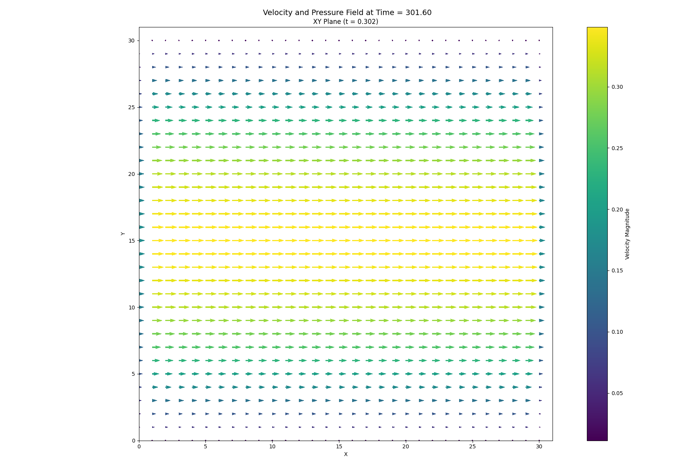

# Physics Simulation and STRidge Identification Report

> Numerical identification of the streamwise momentum equation from saved velocity and pressure fields.

## 1. Simulation Parameters

| Quantity | Symbol | Value | Unit |
|---|---:|---:|---|
| Fluid density | `rho` | `9.20000000e+02` | kg m$^{-3}$ |
| Dynamic viscosity | `viscosity` | `8.10000000e-02` | Pa s |
| Kinematic viscosity | `nu` | `8.80434783e-05` | m$^2$ s$^{-1}$ |
| Characteristic velocity | `u_max` | `1.00000000e+00` | m s$^{-1}$ |
| Characteristic length | `D` | `5.00000000e-03` | m |
| Reynolds number | `Re` | `1.97740055e+01` | dimensionless |
| Body force | `G` | `9.81000000e+00` | m s$^{-2}$ |
| Grid points | `Nx` | `3.10000000e+01` | points |
| Unused transverse grid points | `Ny` | `3.10000000e+01` | points |
| Grid spacing | `dy` | `1.61290323e-04` | m |
| Time step | `dt` | `1.31646880e-04` | s |
| Numerical threshold | `epsilon` | `1.00000000e-15` | - |

## 2. Numerical Discretisation

| Quantity | Symbol | Value | Unit |
|---|---:|---:|---|
| Parameters listed above are the values used by the selected solver. |  |  |  |

## 3. Data and Pre-processing

| Quantity | Value |
|---|---:|
| Loaded field shape $(t, y)$ | `(2143, 31)` |
| Regression field shape $(t, y)$ | `(543, 27)` |
| Regression samples | `14,661` |
| Dictionary terms | `7` |
| First saved time index | `150` |
| Temporal crop at each boundary | `800` layers |
| x-boundary crop | `0` points |
| y-boundary crop | `2` points |

## 4. Governing Equation Verification

### Reference equation

`u_t =8.80434783e-05*u_yy + 9.81000000e+00*one`

### Learned equation

`u_t =8.84726274e-05*u_yy + 9.85781675e+00*one`

| Term | Reference coefficient | Learned coefficient | Absolute error |
|---|---:|---:|---:|
| `u*u_y` | `+0.00000000e+00` | `+0.00000000e+00` | `0.00000000e+00` |
| `u*u_yy` | `+0.00000000e+00` | `+0.00000000e+00` | `0.00000000e+00` |
| `u_y*u_yy` | `+0.00000000e+00` | `+0.00000000e+00` | `0.00000000e+00` |
| `u` | `+0.00000000e+00` | `+0.00000000e+00` | `0.00000000e+00` |
| `u_y` | `+0.00000000e+00` | `+0.00000000e+00` | `0.00000000e+00` |
| `u_yy` | `+8.80434783e-05` | `+8.84726274e-05` | `4.29149147e-07` |
| `1` | `+9.81000000e+00` | `+9.85781675e+00` | `4.78167517e-02` |

## 5. STRidge Selection and Error Metrics

| Metric | Value |
|---|---:|
| Regularisation parameter, $\lambda$ | `1.00000000e-09` |
| Selected tolerance | `1.00000000e-06` |
| L0 penalty | `1.00000000e-06` |
| Training RMSE | `1.11757497e-13` |
| Validation RMSE | `1.24716034e-13` |

## 6. Reproducibility Notes

- Input directory: `/Users/minnie/Desktop/PhysicsFYP/ns_solver/stridge_model/output_poiseuille/u_velocity_field`
- Fields were loaded starting at saved time index `150`.
- Derivatives were calculated using second-order edge-aware finite differences via `numpy.gradient`.
- The learned equation is compared term-by-term with the supplied reference coefficients.
