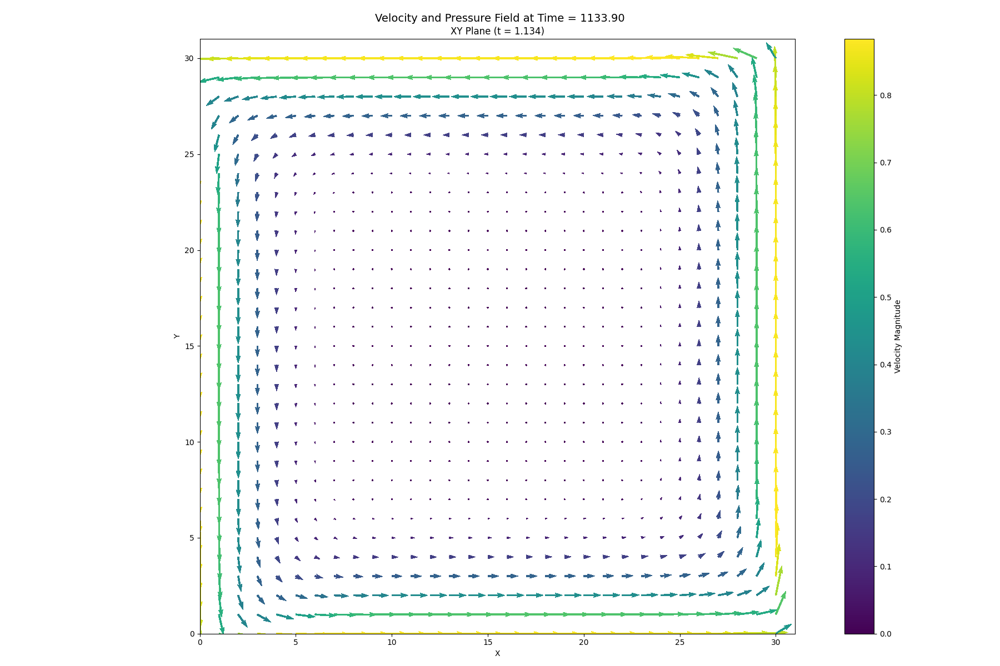

# Physics Simulation and STRidge Identification Report

> Numerical identification of the streamwise momentum equation from saved velocity and pressure fields.

## 1. Simulation Parameters

| Quantity | Symbol | Value | Unit |
|---|---:|---:|---|
| Fluid density | `rho` | `1.00000000e+03` | kg m$^{-3}$ |
| Dynamic viscosity | `viscosity` | `1.00000000e+01` | Pa s |
| Kinematic viscosity | `nu` | `1.00000000e-02` | m$^2$ s$^{-1}$ |
| Characteristic velocity | `u_max` | `1.00000000e+00` | m s$^{-1}$ |
| Characteristic length | `D` | `1.00000000e+00` | m |
| Reynolds number | `Re` | `1.00000000e+02` | dimensionless |
| Body force | `G` | `9.81000000e+00` | m s$^{-2}$ |
| Grid points in x | `Nx` | `3.10000000e+01` | cells |
| Grid points in y | `Ny` | `3.10000000e+01` | cells |
| Grid spacing in x | `dx` | `3.22580645e-02` | m |
| Grid spacing in y | `dy` | `3.22580645e-02` | m |
| Time step | `dt` | `1.00000000e-04` | s |
| Numerical threshold | `epsilon` | `7.00000000e-11` | - |

## 2. Numerical Discretisation

| Quantity | Symbol | Value | Unit |
|---|---:|---:|---|
| Parameters listed above are the values used by the selected solver. |  |  |  |

## 3. Data and Pre-processing

| Quantity | Value |
|---|---:|
| Loaded field shape $(t, x, y)$ | `(9851, 30, 31)` |
| Regression field shape $(t, x, y)$ | `(7451, 22, 27)` |
| Regression samples | `4,425,894` |
| Dictionary terms | `5` |
| First saved time index | `150` |
| Temporal crop at each boundary | `1200` layers |
| x-boundary crop | `4` points |
| y-boundary crop | `2` points |

## 4. Governing Equation Verification

### Reference equation

`u_t =- 1.00000000e+00*uu_x - 1.00000000e+00*vu_y + 1.00000000e-02*u_xx + 1.00000000e-02*u_yy - 1.00000000e-03*p_x`

### Learned equation

`u_t =- 1.39217942e+00*uu_x - 9.75843704e-01*vu_y + 2.41619947e-02*u_xx + 1.02176557e-02*u_yy - 9.61020893e-04*p_x`

| Term | Reference coefficient | Learned coefficient | Absolute error |
|---|---:|---:|---:|
| `uu_x` | `-1.00000000e+00` | `-1.39217942e+00` | `3.92179419e-01` |
| `vu_y` | `-1.00000000e+00` | `-9.75843704e-01` | `2.41562962e-02` |
| `u_xx` | `+1.00000000e-02` | `+2.41619947e-02` | `1.41619947e-02` |
| `u_yy` | `+1.00000000e-02` | `+1.02176557e-02` | `2.17655709e-04` |
| `p_x` | `-1.00000000e-03` | `-9.61020893e-04` | `3.89791068e-05` |

## 5. STRidge Selection and Error Metrics

| Metric | Value |
|---|---:|
| Regularisation parameter, $\lambda$ | `1.00000000e-09` |
| Selected tolerance | `9.42668455e-04` |
| L0 penalty | `1.00000000e-06` |
| Training RMSE | `1.99802752e-02` |
| Validation RMSE | `2.52969478e-02` |

