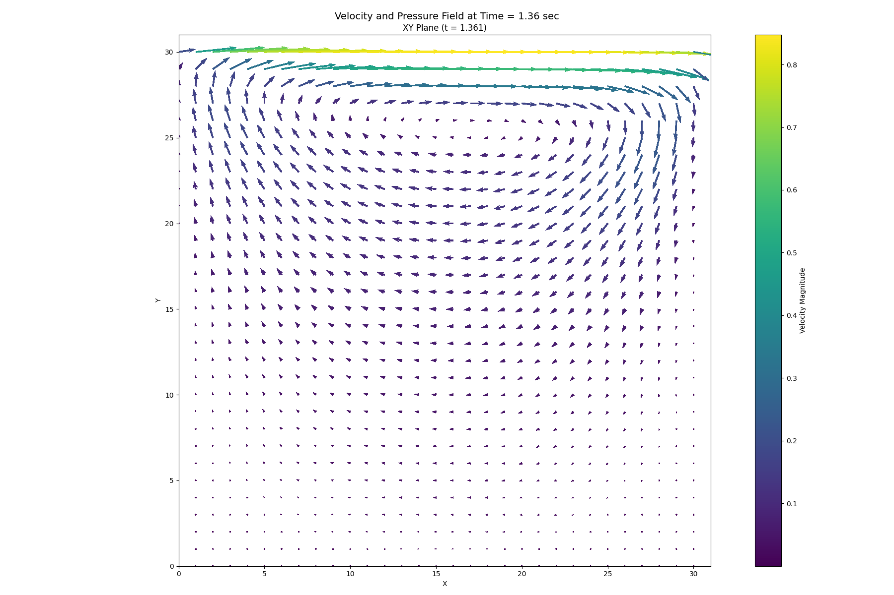

# Physics Simulation and STRidge Identification Report (2D Lid Cavity -- U equation)

> Numerical identification of the streamwise momentum equation from saved velocity and pressure fields.

## 1. Simulation Parameters

| Quantity | Symbol | Value | Unit |
|---|---:|---:|---|
| Fluid density | $\rho$ | `1.00000000e+03` | kg m$^{-3}$ |
| Dynamic viscosity | $\mu$ | `1.00000000e+01` | Pa s |
| Kinematic viscosity | $\nu$ | `1.00000000e-02` | m$^2$ s$^{-1}$ |
| Characteristic velocity | $U$ | `1.00000000e+00` | m s$^{-1}$ |
| Characteristic length | $D$ | `1.00000000e+00` | m |
| Reynolds number | $Re=\rho U D/\mu$ | `1.00000000e+02` | dimensionless |
| Body force | $G$ | `9.81000000e+00` | m s$^{-2}$ |

## 2. Numerical Discretisation

| Quantity | Symbol | Value | Unit |
|---|---:|---:|---|
| Grid resolution | $N_x \times N_y$ | `31 x 31` | cells |
| Grid spacing | $\Delta x, \Delta y$ | `3.22580645e-02, 3.22580645e-02` | m |
| Time step | $\Delta t$ | `1.00000000e-04` | s |
| Numerical threshold | $\epsilon$ | `7.00000000e-11` | - |
| Advective coefficient | $c_a$ | `1.00000000e+00` | - |
| Pressure coefficient | $c_p=1/\rho$ | `1.00000000e-03` | m$^3$ kg$^{-1}$ |
| Viscous coefficient | $c_v=1/Re$ | `1.00000000e-02` | - |

## 3. Data and Pre-processing

| Quantity | Value |
|---|---:|
| Loaded field shape $(t, x, y)$ | `(6655, 30, 31)` |
| Regression field shape $(t, x, y)$ | `(4255, 22, 27)` |
| Regression samples | `2,527,470` |
| Dictionary terms | `5` |
| First saved time index | `150` |
| Temporal crop at each boundary | `1200` layers |
| x-boundary crop | `4` points |
| y-boundary crop | `2` points |

## 4. Governing Equation Verification

### Reference equation

`u_t =- 1.00000000e+00*uu_x - 1.00000000e+00*vu_y + 1.00000000e-02*u_xx + 1.00000000e-02*u_yy - 1.00000000e-03*p_x`

### Learned equation

`u_t =- 1.13842289e+00*uu_x - 1.03055812e+00*vu_y + 8.40649079e-03*u_xx + 1.03461437e-02*u_yy - 1.04792514e-03*p_x`

| Term | Reference coefficient | Learned coefficient | Absolute error |
|---|---:|---:|---:|
| `uu_x` | `-1.00000000e+00` | `-1.13842289e+00` | `1.38422889e-01` |
| `vu_y` | `-1.00000000e+00` | `-1.03055812e+00` | `3.05581219e-02` |
| `u_xx` | `+1.00000000e-02` | `+8.40649079e-03` | `1.59350921e-03` |
| `u_yy` | `+1.00000000e-02` | `+1.03461437e-02` | `3.46143665e-04` |
| `p_x` | `-1.00000000e-03` | `-1.04792514e-03` | `4.79251383e-05` |

## 5. STRidge Selection and Error Metrics

| Metric | Value |
|---|---:|
| Regularisation parameter, $\lambda$ | `1.00000000e-09` |
| Selected tolerance | `9.42668455e-04` |
| L0 penalty | `1.00000000e-06` |
| Training RMSE | `1.10494359e-02` |
| Validation RMSE | `6.16076275e-03` |

## 6. Reproducibility Notes

- Input directories: `/Users/minnie/Desktop/PhysicsFYP/ns_solver/stridge_model/output_lidcav`
- Velocity and pressure fields were loaded starting at saved time index `150`.
- Derivatives were calculated using second-order edge-aware finite differences via `numpy.gradient`.
- The learned equation is compared term-by-term with the reference Navier-Stokes coefficients defined in this script.
